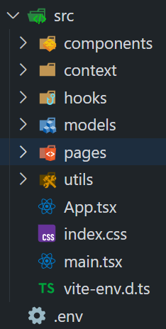
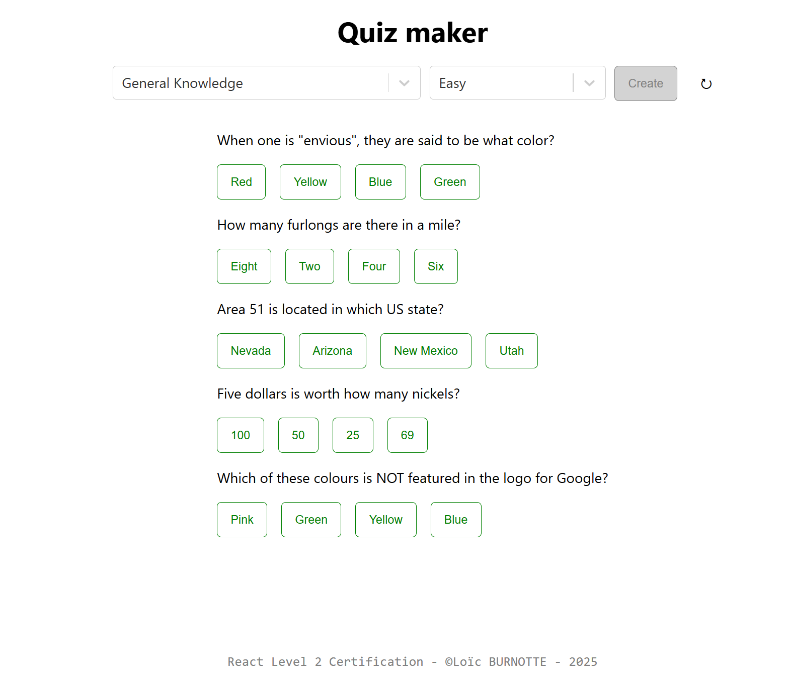
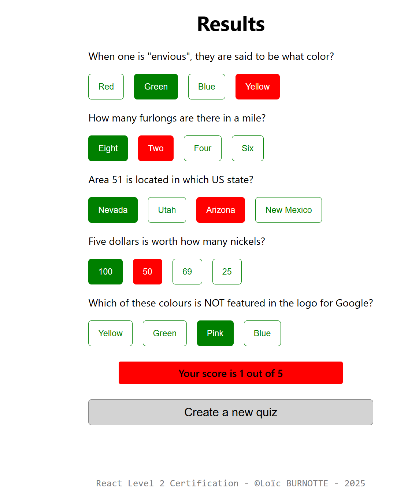

# React level 2 Certification

**React** + **TypeScript** + **Vite**

### Packages

- **he** (_to format string render_)
- **react-error-boundaries** (_to manage fetching issues and display a fallback message_)
- **react-router** (_to manage routing_)
- **react-select** (_to display a beautiful dropdown_)

# Structure

|- **components** (_all generic components_)
|- **context** (_results context stored and shared between pages_)
|- **hooks** (_custom reusable hooks_)
|- **models** (_all types and interfaces_)
|- **pages** (_all pages_) <Home /> & <Results />
|- **utils** (_helpers and queryClient config_)
**App.tsx** (_All centralized Providers_)
**main.tsx** (_where the react-dom/client has been implemented_)

# Preview

**Example of the home page**

**Example of the results page**

# Copyright

**©Loïc BURNOTTE**
